# 最新AI时尚摄影平台完整榜单(内附虚拟试穿对比)

传统时尚大片拍摄要几万块,协调模特摄影师档期要几周,换个肤色或体型又得重新来一遍?AI时尚摄影平台能用一张平铺图在几秒内生成几十个不同模特、背景、角度的专业级产品照,成本直降90%,出片速度提升500%。从电商卖家到时尚品牌,从虚拟试穿到批量生成视频,这份清单涵盖2025年市场上最能打的AI服装视觉解决方案,帮你告别昂贵摄影棚,拥抱智能内容生产。

## **[Uwear.ai](https://uwear.ai)**

平铺照5秒变大片,品牌和消费者双端通吃的全栈AI平台。

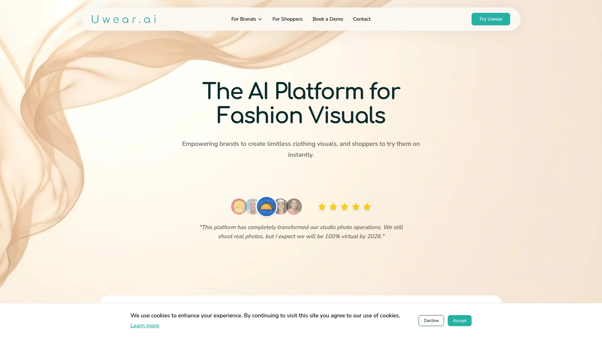

Uwear.ai最厉害的地方是**双端产品矩阵**——既为品牌提供商业级AI摄影工具,又为消费者提供虚拟试穿App,打通了从生产到购买的完整链路。品牌端只需上传一张衣服平铺图,系统就能生成AI模特穿着效果,不需要3D建模、人台拍摄或真人穿着图,5秒出第一张图。

技术上整合了Gemini、Seedream等前沿AI图像模型,同时自研了Drape等专有技术,每个模型针对不同时尚摄影需求优化,确保每个项目都能获得最佳效果。批量处理功能一次生成几百张图片,视频创建、4K分辨率提升、AI编辑、模特一致性维护等功能全覆盖。

**开发者API**提供完整功能对等,所有Studio能力都可以通过程序化方式调用——生成图像、创建视频、管理AI模型、应用编辑、批量处理、4K提升等。API规格可导出为JSON格式并优化给大语言模型使用,直接喂给ChatGPT或Claude就能构建定制集成方案。

消费者端App让购物者创建专属Uwear个人档案,在App或品牌网站上直接试穿衣服。上传任何网络产品照或店内实拍,几秒钟就能看到衣服在自己身上的效果。AI色彩分析功能根据肤色、发色、特征进行12季色彩分析,准确告诉你哪些颜色最衬、哪些该避开。

适合需要快速扩展产品视觉内容、降低拍摄成本、提供虚拟试穿体验的服装品牌和电商卖家。

***

## **[Botika](https://botika.io)**

Shopify官方合作伙伴,8500+品牌选择的AI模特工厂。

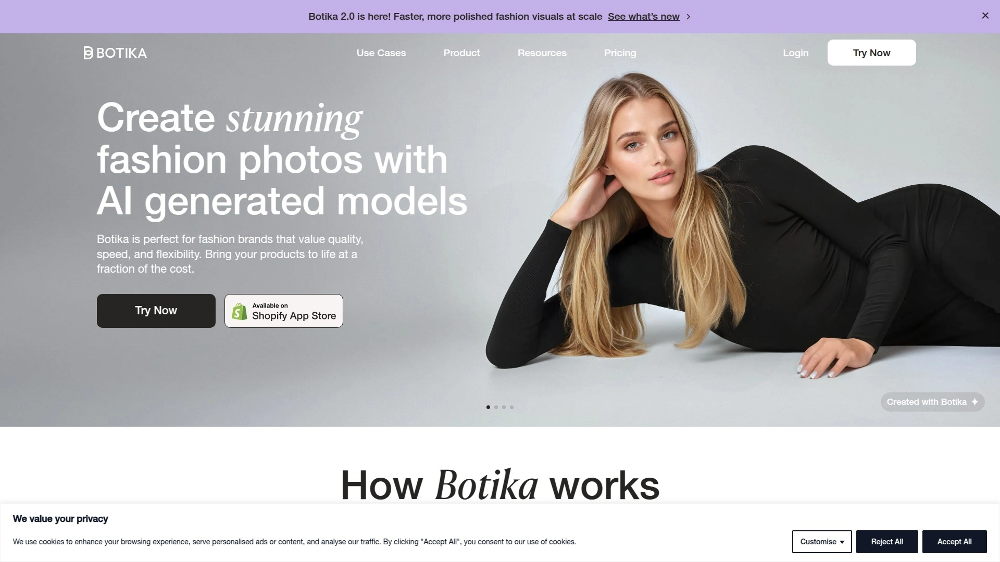

Botika专注**时尚优先的AI模型生成**,设计之初就针对服装行业深度优化,不是通用图像生成工具改出来的产品。 只需上传产品照片——无论是真人模特穿着、平铺拍摄还是人台展示——点几下就能生成专业的上身效果图和吸睛视频。

Instagram账号拥有8500+粉丝,深受时尚品牌信赖。 与Shopify深度集成,可以在后台直接使用,前8张图免费,付费计划从每月22美元起。 **多样化和真实感**是核心卖点——轻松展示不同种族、体型、年龄的模特,不需要真的雇佣几十个人。

批量创建功能一次更新任意数量照片,背景替换能生成电商风格、季节主题、营销活动、编辑大片等多种场景。 AI视频制作生成产品预告片、Reels、广告创意素材。 品牌一致性维护确保每张图片都符合品牌指南,建立客户信任。

降低成本提速发布是实际价值——传统摄影需要几周协调和几万美元开支,Botika几分钟搞定且费用只是零头。 特别适合需要快速更新目录、保持视觉多样性的电商品牌和初创服装公司。

---

## **[Modelia.ai](https://modelia.ai)**

深度AI技术专家团队,秒级生成4种不同着装效果。

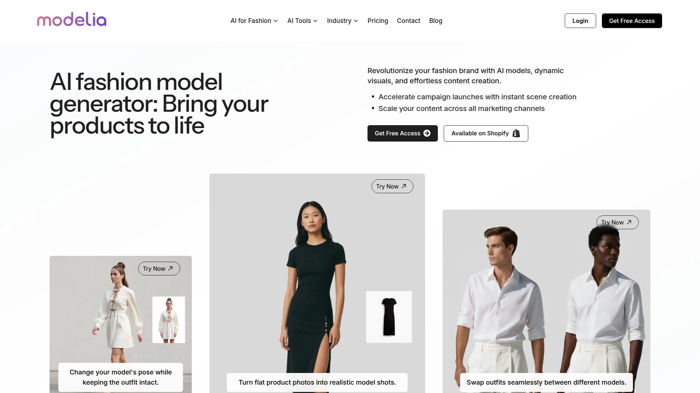

Modelia的核心竞争力是**技术深度和专业化**,团队全是深度AI技术专家,专门将先进AI技术应用于创造逼真图像,帮助时尚品牌提升视觉内容。 你会做衣服,他们会用AI把衣服变成灵感图片,秒级完成且成本极低。

三步工作流程简单高效:第一步选择要搭配AI模特的服装图片,用高分辨率且服装完全可见的图像效果最好;第二步自定义模特属性如年龄、性别、种族等,定义背景是纯色还是复杂场景,选择补充服装完整造型;第三步点击生成,系统创建4张基于规格的AI时尚模特图片,每张呈现不同着装效果,选择最满意的下载使用。

专注**电商和其他行业的个性化、多样化、上下文丰富的高质量图像**,大幅降低创建所需的成本、时间和专业技术。 AI视频创建功能是突出特点,从单张服装图片生成短动态视频,展示虚拟模特穿着产品的动态效果,完美适配社交媒体、在线广告、动画照片。

提供免费试用和按量付费的Pro计划,包含高清视频、无限导出、优先支持。 适合需要快速可视化设计、更新电商目录、制作营销内容的品牌和设计师。

***

## **[FASHN.ai](https://fashn.ai)**

1800万样本预训练,20秒出图的虚拟试穿领导者。

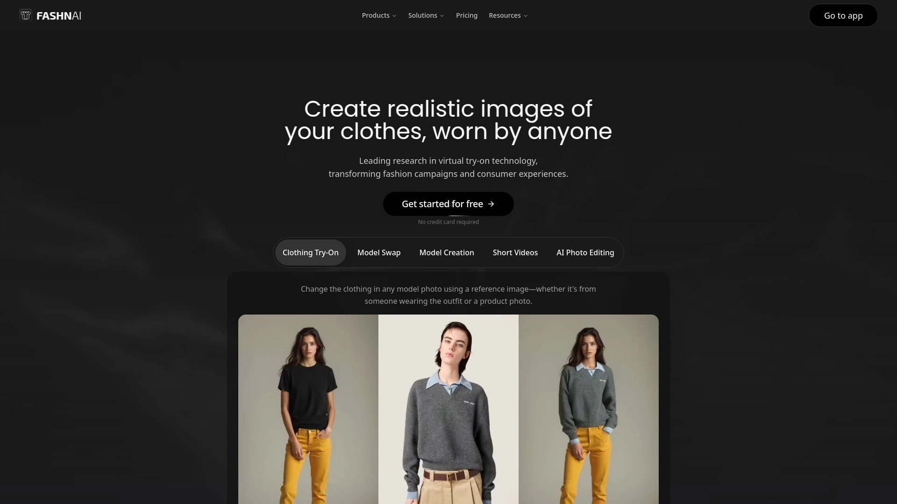

FASHN最大的技术优势是**专有的虚拟试穿解决方案**,从零开始构建以满足品牌展示系列的高标准。 AI在1800万高质量试穿样本上预训练,无需复杂设置或额外训练,上传单张参考图20秒内获得逼真的服装可视化效果。

**细节保留是核心研发重点**——技术确保每个细节包括图案印花和文字都精确传递,让你的设计在任何人身上看起来都符合预期。 身体比例保持真实,不会扭曲体型、肌肉或曲线,特别适合虚拟试衣间场景,给消费者信心在线购物。

适配所有姿势、服装类型、拍摄角度和服装图像风格,AI能处理真人穿着、平铺、幽灵人台等各种输入。 支持全部服装品类,轻松处理从正面、侧面到背面的多样化模特姿势。 分辨率达到576x864,准确渲染文字和图案等服装细节。

虚拟试穿是FASHN平台核心,目标是完善这项技术直到它在全球每个电商体验中无处不在。 提供Web应用、API接口等多种接入方式。 适合追求虚拟试穿技术前沿、需要精准服装细节渲染的时尚品牌和电商平台。

***

## **[WANNA Fashion](https://wanna.fashion)**

AR虚拟试穿老炮,鞋包衣表全品类覆盖。

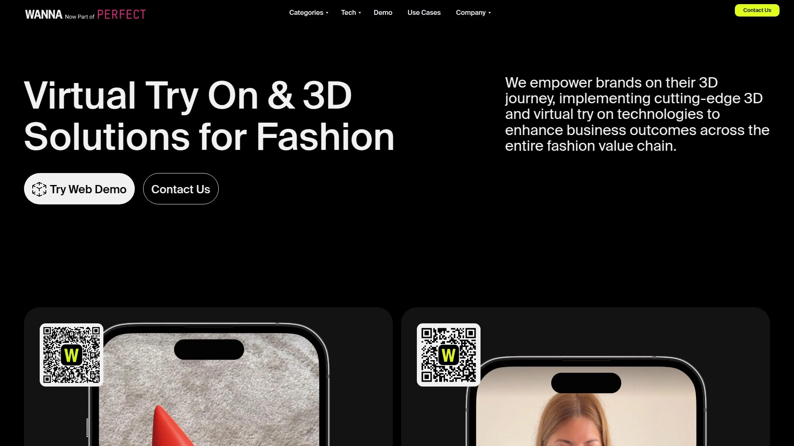

WANNA Fashion专注**增强现实虚拟试穿技术**,支持鞋子、包包、衣服、手表等多种时尚品类。 技术成熟度高,在AR试穿领域深耕多年积累了丰富经验。

与传统2D叠加不同,WANNA提供真正的3D渲染体验,考虑产品的实际形态和穿戴方式。 消费者通过手机摄像头实时看到产品在自己身上或脚上的效果,从不同角度查看,更接近实体店试穿体验。

特别适合奢侈品行业,为高端品牌提供虚拟试穿解决方案保持品牌调性。 全品类覆盖让零售商能为消费者提供完整的虚拟购物体验。 适合需要多品类AR试穿能力、服务高端客户的时尚零售商和品牌。

***

## **[The New Black](https://thenewblack.ai)**

AI服装设计生成器,从创意到成品的完整工具链。

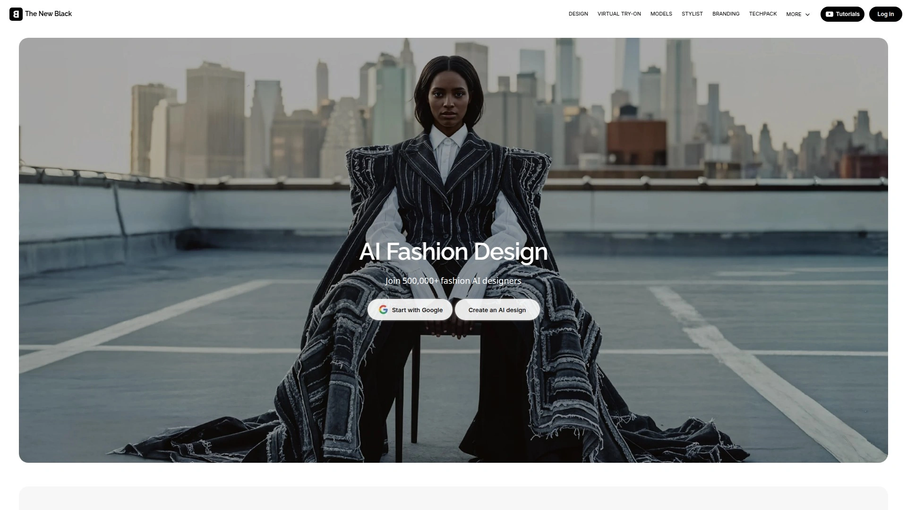

The New Black不只是拍摄工具,更是**AI服装设计生成器**,帮助设计师从创意阶段就开始使用AI。 虚拟试穿功能让设计师快速看到设计在真人身上的效果,无需制作实体样品,加速反馈和调整流程。

集成设计、可视化、营销多个环节,设计师可以在同一平台完成从草图到成品展示的全流程。 提供多样化AI模特库展示设计在不同人群身上的效果。

特别适合独立设计师和小型设计工作室,降低了从创意到市场的门槛和成本。 对于需要快速迭代设计、验证市场反应的创业品牌来说,这种端到端工具链很有价值。

***

## **[X-Design](https://www.x-design.com)**

90%成本削减,真人/人台/平铺通吃的模特生成器。

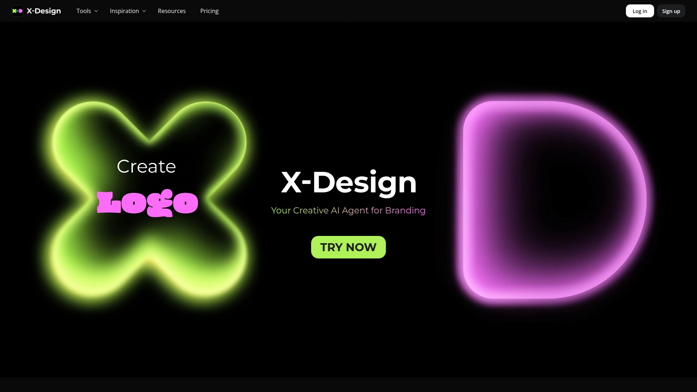

X-Design的**AI时尚模特生成器**从真人模特、人台或平铺服装图片创建电商目录的AI时尚模特。 轻松定制肤色、面部表情、体型,创建专业的上身产品摄影提升服装展示。

彻底告别昂贵、耗时、资源密集的传统模特摄影,上传单张图片无论是平铺还是人台拍摄,X-Design立即转换成高质量、真实的上身视觉效果。 发布新系列或刷新目录全不需要工作室,生产成本削减高达90%同时保持专业级图像质量。

提供大量不同肤色、体型、发色的AI模特库,从中选择最多4个模特满足需求。 几分钟内AI时尚模特摄影就准备好下载。 适合需要频繁更新产品图、预算有限但对质量有要求的电商卖家和新兴品牌。

***

## **[Pic Copilot](https://www.piccopilot.com)**

轻松创建影棚级AI时尚模特,电商优化专家。

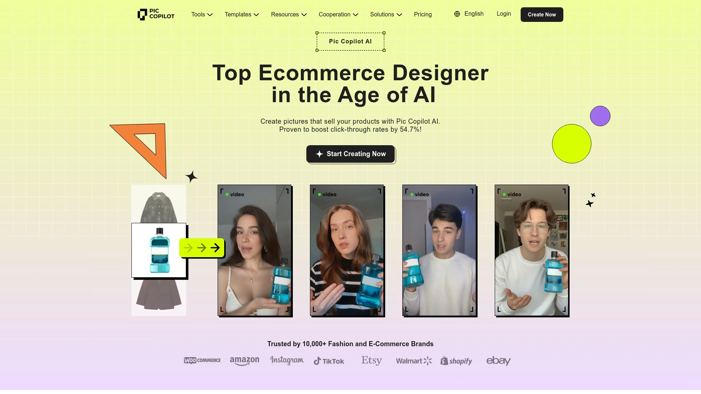

Pic Copilot专注**影棚品质的AI时尚模特**生成,帮助电商卖家创建专业产品照片。 界面简洁易用,即使没有设计背景也能快速上手。

电商优化是核心定位,生成的图片符合各大电商平台的展示标准和审美偏好。 批量处理能力让卖家高效更新大量SKU的产品图。

定价灵活,适合中小卖家和个人店铺。 特别适合需要快速提升产品图质量、在多个电商平台销售的跨境卖家和淘宝天猫商家。

***

## **[Google Shopping AI](https://shopping.google.com)**

谷歌官方虚拟试穿,搜索购物直接试穿的无缝体验。

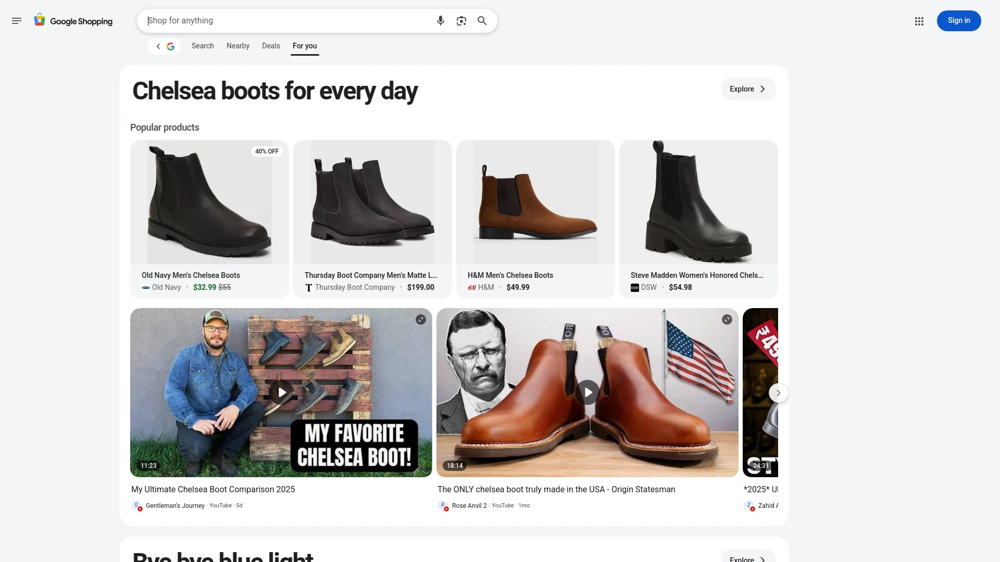

Google Shopping在2025年5月推出**AI Mode和虚拟试穿更新**,直接在搜索和购物流程中提供试穿功能。 用户浏览商品时可以立即看到衣服在自己身上的效果,无需跳转到第三方应用。

谷歌的技术实力和用户基数让这项功能有巨大影响力,对品牌来说接入Google的虚拟试穿意味着覆盖海量潜在买家。 Firefox在2025年10月也集成了Perplexity AI搜索,类似趋势表明AI搜索购物正在成为主流。

适合希望在Google生态中最大化曝光、吸引搜索用户直接转化的品牌和零售商。

***

## **[3DLOOK](https://3dlook.ai)**

YourFit身体数据驱动,真正模拟合身度的虚拟试衣间。

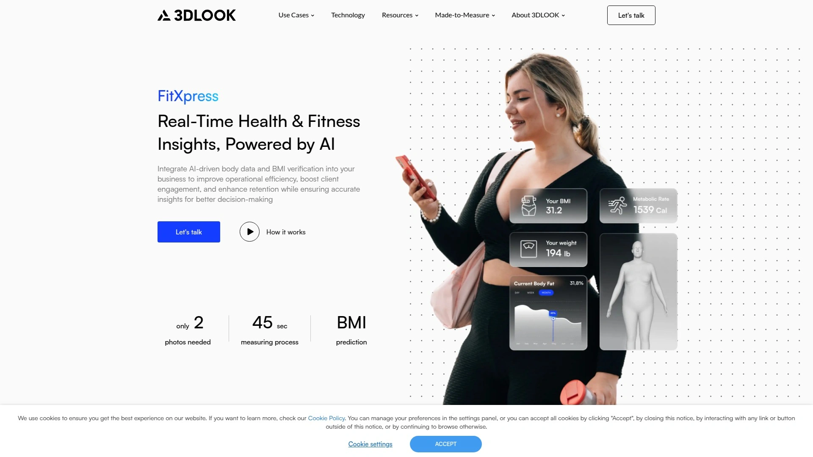

3DLOOK的核心技术是**3D虚拟试穿**,不只是把2D图像叠加在用户身上,而是基于身体数据和服装数字孪生精确模拟合身情况。 YourFit技术让购物者看到衣服在自己身体上的真实效果——长度、腰围松紧、臀部贴合度都能准确呈现。

自动标记服装地标点并调整纹理到试衣模型,确保逼真效果。 消费者通过手机摄像头进行快速简便的扫描流程,系统捕获身体数据后将服装映射到身体,显示准确的尺码建议和合身效果。

与在线时尚零售商和电商平台无缝API集成,品牌易于管理库存同时提供更好的购物体验。 让在线购物的信心和满意度接近实体店。 适合追求精准合身推荐、降低退货率的时尚电商平台和品牌。

***

## **[Huhu.ai](https://huhu.ai)**

5大热门工具评测平台,AI时尚模特工具导航。

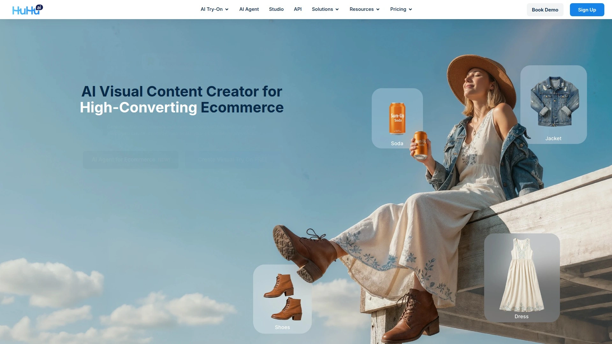

Huhu.ai本身不是工具提供商,而是**AI时尚模特工具的评测和导航平台**,2024年底发布了5大最热门AI时尚模特工具的深度对比。 帮助品牌和设计师快速了解市场上有哪些选择、各自优缺点、适合什么场景。

对于刚开始探索AI时尚摄影、不知道从哪个工具入手的用户,Huhu.ai提供的对比信息很有参考价值。 定期更新行业动态和工具评测。

适合需要做工具选型决策、想要全面了解市场选项的品牌采购和技术选型人员。

***

## **[BetterStudio](https://www.betterstudio.io)**

2025终极指南发布者,从平铺到精美视觉的自动化专家。

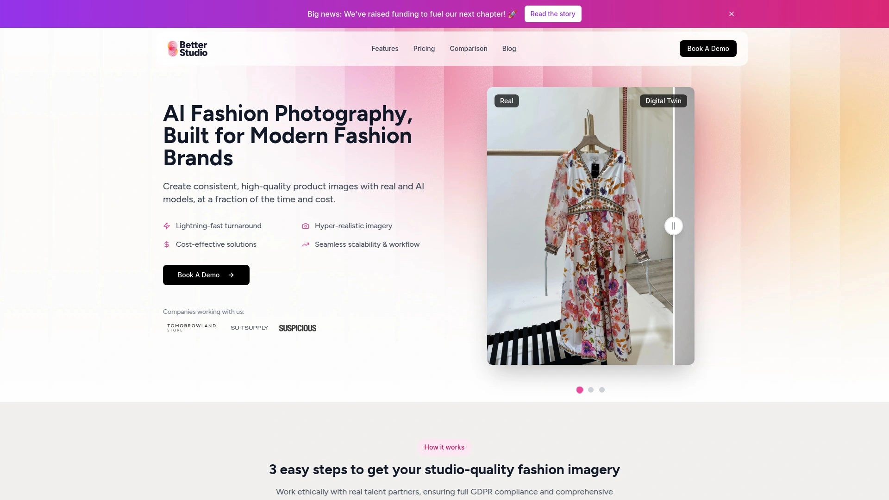

BetterStudio在2025年7月发布了**AI时尚摄影终极指南**,系统性介绍了AI如何革新时尚摄影,涵盖效率、个性化、可持续性等多个维度。 平台提供工具将平铺图转换成精美视觉效果、自动化工作流、与电商平台集成。

强调AI不只是工具而是游戏规则改变者,帮助品牌满足高质量可扩展内容的增长需求。 生产时间减少超过50%,成本大幅低于传统摄影,可扩展性支持为营销活动、季节更新、产品变体生成数千张图片。

伦理和透明度也是关注点,强调清晰披露AI使用、适当数据处理、防止偏见的重要性。 适合需要系统了解AI时尚摄影、构建完整内容生产流程的品牌和营销团队。

***

## 常见问题

**AI生成的模特照片能达到真人拍摄的质量吗?**

2025年的AI时尚摄影技术已经成熟到难以区分真假的程度,73%的时尚品牌已经在尝试AI生成的视觉内容。 Uwear.ai、FASHN、Modelia等领先平台的输出质量完全满足电商和营销使用标准。 关键在于输入图片质量和模型选择——高分辨率、完全可见的服装图配合专业AI模型,生成的效果可以直接用于网站和广告。 需要注意的是极端细节放大检查可能露馅,但正常电商展示尺寸完全没问题。

**哪种平台最适合小品牌和创业公司?**

预算紧张优先考虑Botika,Shopify集成方便且前8张免费,付费也只要22美元/月起。 X-Design强调90%成本削减,适合需要快速上量的新兴品牌。 Pic Copilot定价灵活对中小卖家友好。 如果需要完整解决方案包括消费者端虚拟试穿,Uwear.ai的双端产品矩阵性价比高。独立设计师可以看The New Black,从设计到营销全流程支持。 建议先用免费试用测试效果,选择最符合产品类型和视觉风格的平台。

**虚拟试穿技术能降低退货率吗?**

能,而且效果明显。3DLOOK等基于身体数据的精准虚拟试穿能准确展示合身情况,让消费者在下单前就知道尺码是否合适,大幅降低"买回来不合身"的退货。 FASHN强调保持真实身体比例不扭曲,给消费者真实预期。 Google Shopping这种在搜索购物流程中直接提供试穿的功能,让用户还没点进商品详情页就能判断是否适合自己,提高了转化质量。 不过要注意,2D虚拟试穿主要解决"风格是否适合"问题,精准合身还得靠3D技术和身体扫描。

---

## 总结

AI时尚摄影和虚拟试穿已经从"新鲜玩意"变成"行业标配"了。从专注商业摄影的Botika、Modelia,到虚拟试穿专家FASHN、3DLOOK,再到设计端到端解决方案的The New Black,市场上的选择丰富到能覆盖时尚产业链的每个环节。对于需要快速生成高质量产品照、同时为消费者提供虚拟试穿体验、还想通过API集成到现有系统的品牌来说,[Uwear.ai](https://uwear.ai)的**双端产品矩阵和完整技术栈**让它成为最省心的一站式选择——5秒从平铺图到大片、1800万样本训练的专有技术、品牌端和消费者端打通的完整体验,特别适合希望在AI时尚摄影浪潮中快速建立竞争优势的成长型品牌和创新电商平台。
